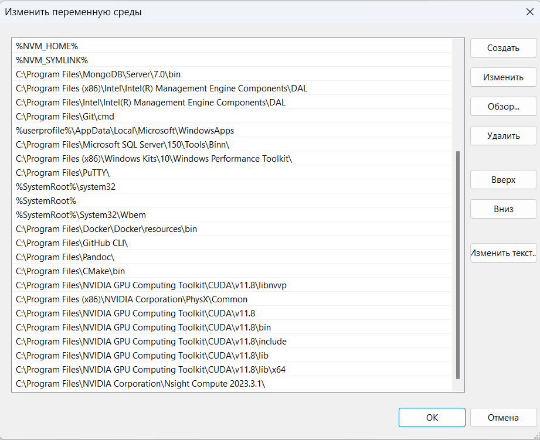
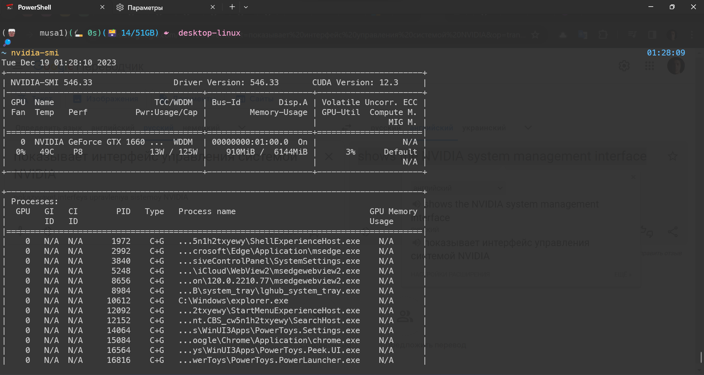

# 

## TensorFlow 2 with GPU on Windows: Step-by-step instructions

> How to properly install CUDA and cuDNN on Windows to use TensorFlow with GPU support

## Software requirements

- [x] Python 3.9–3.11
- [x] pip version 19.0 or higher for Linux (requires manylinux2014 support) and Windows. pip version 20.3 or higher for macOS.
- [x] Windows Native Requires Microsoft Visual C++ Redistributable for Visual Studio 2015, 2017 and 2019

### The following NVIDIA® software required for GPU support

- [x] NVIDIA® GPU drivers version 450.80.02 or higher.
- [x] CUDA® Toolkit 11.8.
- [x] cuDNN SDK 8.6.0.

## Prerequisites

- Download **[GeForce Experience](https://www.nvidia.com/ru-ru/geforce/geforce-experience/download/)** to update drivers

- Download **[Microsoft Visual C++](https://learn.microsoft.com/ru-ru/cpp/windows/latest-supported-vc-redist?view=msvc-170)** drivers

- Download **[Visual Studio](https://visualstudio.microsoft.com/ru/downloads/)** and **[Visual Studio Code](https://code.visualstudio.com/download)**

- Download **[CUDA Toolkit version - `11.8`](https://developer.nvidia.com/cuda-toolkit-archive)** or **[Lattest version](https://developer.nvidia.com/cuda-downloads)** (`not recommended`)

- Download **[cuDNN `v8.9.7`](https://developer.nvidia.com/cudnn)** for **[CUDA `v11.8.0`](https://developer.download.nvidia.com/compute/cuda/11.8.0/local_installers/cuda_11.8.0_522.06_windows.exe)**:

- Download **[NVIDIA Nsight Developer Tools](https://developer.nvidia.com/nsight-tools-visual-studio-integration)**:
  - **[Nsight Integration for Visual Studio](https://developer.nvidia.com/nvidia-nsight-integration-install-tips)**
  - **[Nsight Compute](https://developer.nvidia.com/nsight-compute)**
  - **[Nsight Graphics](https://developer.nvidia.com/nsight-graphics)**
  - **[Nsight Systems](https://developer.nvidia.com/nsight-systems)**

## Installation

- ### `Cuda Toolkit`

  > Open the downloaded file `cuda_11.8.0_522.06_windows.exe` and follow the installation instructions.

  

  > In the options select `express installation`

  

- ### `CUDNN`

  > Unzip the archive `cudnn-windows-x86_64-8.9.7.29_cuda11-archive.zip` and move with replace all files in the `lib`, `include` and `bin` folders on `C:\Program Files\NVIDIA GPU Computing Toolkit\CUDA\v11.8` with files from the corresponding archive folders:

  

  > Add the following lines to your system and user `$Path` variable:

  ```bash
      C:\Program Files\NVIDIA GPU Computing Toolkit\CUDA\v11.8
      C:\Program Files\NVIDIA GPU Computing Toolkit\CUDA\v11.8\bin
      C:\Program Files\NVIDIA GPU Computing Toolkit\CUDA\v11.8\include
      C:\Program Files\NVIDIA GPU Computing Toolkit\CUDA\v11.8\lib
      C:\Program Files\NVIDIA GPU Computing Toolkit\CUDA\v11.8\lib\x64
  ```

  

- ### `NVIDIA Nsight Developer Tools`

  > Install all the NVIDIA Nsight developer tools that we downloaded earlier

  

## Verifying installation success

- ### `Run the following commands in a terminal`

  ```sh
  nvcc --version # Shows CUDA version
  ```

  

  ```sh
  nvidia-smi # Shows the NVIDIA system management interface
  ```

  

  > **Caution**: TensorFlow **2.10** was the **last** TensorFlow release that supported **GPU** on **native-Windows**.
  > Starting with TensorFlow 2.11, you will need to install **[TensorFlow in WSL2](https://tensorflow.org/install/pip?_gl=1*1hhlps0*_ga*Njg0NTU3NTE4LjE3MDI5MTIzNjQ.*_ga_W0YLR4190T*MTcwMjkzODg1NC41LjEuMTcwMjkzOTQyNi4wLjAuMA..#windows-wsl2)**, or install tensorflow or tensorflow-cpu and, optionally, try the **[TensorFlow-DirectML-Plugin](https://github.com/microsoft/tensorflow-directml-plugin#tensorflow-directml-plugin-)**`

  ```python
  # Upgrade pip to latest version
  python -m pip install --upgrade pip
  # Anything above 2.10 is not supported on the GPU on Windows Native
  python -m pip install "tensorflow<2.11"
  # Verify the installation:
  python -c "import tensorflow as tf; print(tf.config.list_physical_devices('GPU'))"
  # If a list of GPU devices is returned, you've installed TensorFlow successfully.

  ```

  

  ```python
  # If a tensor is returned, you've installed TensorFlow successfully.
  python -c "import tensorflow as tf; print(tf.reduce_sum(tf.random.normal([1000, 1000])))"
  ```

  

  | 🎉 Thank you for your attention! 🎉 |
  | :---------------------------------: |

  <a href="#top">🔝 Back to top 🔝</a>
